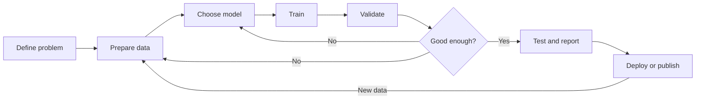
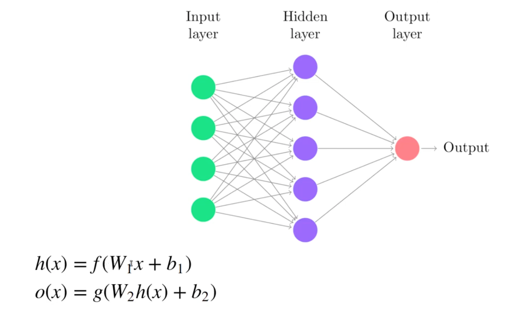
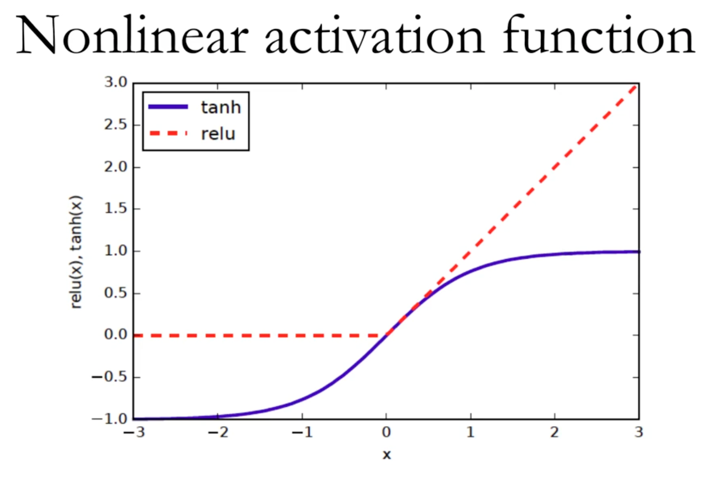
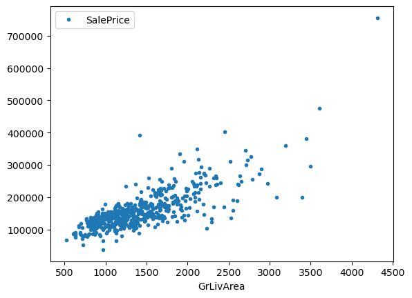
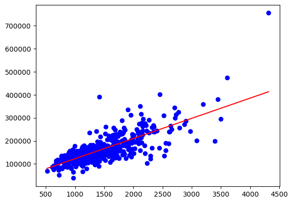
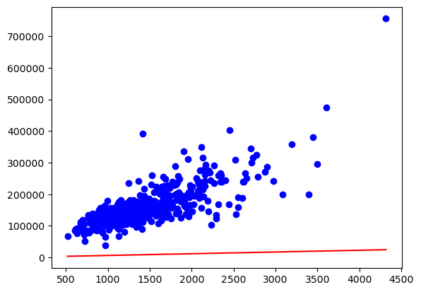
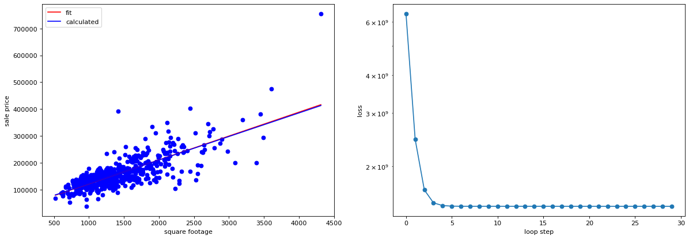

# Applied Machine Learning — Overview

**Duration:** ~40 minutes

This tutorial builds conceptual foundations before the hands-on [workshop.ipynb](workshop.ipynb) session. You will learn *how* a standard ML project is structured, and *what* happens inside a neural network.

> **Next step:** After this tutorial, run [workshop.ipynb](workshop.ipynb) to apply the workflow to a CNN on chest X-rays.

---

## Part 1 — Machine learning in science

Traditional scientific modeling often relies on physics-based numerical simulations. These models are principled and interpretable, but they can be **slow to run** and **difficult to calibrate** across complex, multi-scale systems.

Machine learning offers a complementary approach: learn patterns directly from data, often achieving useful accuracy with far less runtime. In weather and climate, for example, data-driven forecasting has shifted how researchers balance speed, accuracy, and computational cost.

Pure ML is not the only option. Hybrid approaches combine data-driven learning with domain knowledge:


| Methodology                                  | Purpose                                                                       | Scientific benefit                            |
| -------------------------------------------- | ----------------------------------------------------------------------------- | --------------------------------------------- |
| **Physics-Informed Neural Networks (PINNs)** | Embed physical laws (e.g., thermodynamics, mass balance) in the loss function | Prevents physically impossible predictions    |
| **Differentiable simulation**                | Combine ML gradients with numerical simulators                                | Accelerates simulation by orders of magnitude |
| **Surrogate modeling**                       | Train lightweight models to approximate expensive simulations                 | Enables millions of real-time scenario trials |


**Where ML adds value in science:**

1. Discovering patterns from extensive observational or experimental data
2. Replacing or accelerating expensive simulations
3. Modeling complicated multi-physics interactions
4. Continuously improving as new data becomes available

> **Key idea:** ML does not replace scientific reasoning — it extends what we can compute and predict within scientific workflows.

---

## Part 2 — What is machine learning?

**Machine learning** is the process of learning patterns from data so a system can perform tasks on new, unseen inputs — such as predicting a value, classifying an observation, or revealing hidden structure.

Think of teaching a computer about fruit in a basket:


| Type                       | Analogy                               | What the model learns                             |
| -------------------------- | ------------------------------------- | ------------------------------------------------- |
| **Supervised learning**    | Fruit with labels ("apple", "banana") | Map inputs to known outputs from labeled examples |
| **Unsupervised learning**  | Unlabeled mixed fruit                 | Group similar items without predefined categories |
| **Reinforcement learning** | Puppy rewarded for fetching apples    | Optimal actions through trial, error, and rewards |


**This course focuses on supervised learning** — the most common starting point in applied science (e.g., predict house price from size, classify an X-ray as pneumonia or normal).

Two supervised task types you will encounter:

- **Regression** — predict a continuous value (house price, temperature)
- **Classification** — predict a category (pneumonia / normal, material type A / B)


---

## Part 3 — The machine learning cycle

Every ML project follows a repeating workflow. Memorize these steps — they reappear in every notebook in this course.


| Step                  | What you do                                             | Example (pneumonia workshop)                              |
| --------------------- | ------------------------------------------------------- | --------------------------------------------------------- |
| 1. **Define problem** | State the real-world goal and a measurable proxy metric | Goal: detect pneumonia; metric: recall on pneumonia class |
| 2. **Prepare data**   | Load, clean, explore, split, preprocess                 | Load X-rays; normalize pixels; train/val/test split       |
| 3. **Choose model**   | Match architecture to data type; start simple           | CNN for images; linear regression for tabular baseline    |
| 4. **Train**          | Minimize loss by updating model weights                 | Forward → loss → backward → optimizer step                |
| 5. **Validate**       | Monitor performance on held-out validation data         | Track val accuracy each epoch; tune learning rate         |
| 6. **Test & report**  | Evaluate once on test set; report metrics and failures  | Confusion matrix; inspect misclassified X-rays            |
| 7. **Iterate**        | Loop back if performance or requirements change         | Add augmentation, change architecture, collect more data  |





**Critical rule:** the **test set** is touched only once, at the end. Validation guides tuning; testing estimates real-world performance.

> **Checkpoint:** For a climate prediction project, what would be a real-world goal and a proxy metric?

---

## Part 4 — Problem definition and success measures

Before writing any code, clarify three things:

1. **Real-world goal** — What decision or outcome does the model support?
  - *Example:* Help clinicians flag pneumonia cases earlier from chest X-rays.
2. **Proxy metric** — What can you measure in data that stays close to the real goal?
  - *Example:* Recall for the pneumonia class (minimize missed cases).
3. **Baseline and cost** — What is the simplest approach, and is added complexity justified?
  - Start with a linear model or simple heuristic before a deep network.
  - Consider data collection cost, training time, and maintenance.

**Best practices:**

- Communicate results in the problem context, not only as accuracy numbers.
- A false negative (missed pneumonia) may be more costly than a false positive — choose metrics accordingly.
- Data-driven first: let the problem and data shape the model, not the other way around.

**Key evaluation metrics:**

- **Accuracy:** Proportion of all predictions that are correct.  
  $$\( \text{Accuracy} = \frac{\text{TP} + \text{TN}}{\text{Total}} \)$$
- **Precision:** Out of all predicted positives, how many are actually positive (few false alarms).  
  $$\( \text{Precision} = \frac{\text{TP}}{\text{TP} + \text{FP}} \)$$
- **Recall (Sensitivity):** Out of all actual positives, how many did we catch (few misses).  
  $$\( \text{Recall} = \frac{\text{TP}}{\text{TP} + \text{FN}} \)$$
- **F-score (F1):** Harmonic mean of precision and recall; balances both.  
  $$\( \text{F1} = 2 \cdot \frac{\text{Precision} \cdot \text{Recall}}{\text{Precision} + \text{Recall}} \)$$

Where TP=True Positives, TN=True Negatives, FP=False Positives, FN=False Negatives.

Use precision and recall when class imbalance matters, or missing certain outcomes is riskier than others.

> **Checkpoint:** Be careful if the dataset is imbalanced   

---

## Part 5 — Neural network concepts

A **neural network** is a stack of **neurons** organized in **layers**. Each neuron applies weights and a bias, then an **activation function**. Training adjusts the weights to minimize a **loss function**.

Linear regression is the simplest case: one weighted sum plus bias. Deep networks stack many such operations with nonlinear **activation functions**.  
<p align="center">
   
</p>  

**Activation Function**  
<p align="center">
   
</p>  

**Dropout**  

  <p align="center">
   
 </p>  


### Building blocks


| Concept                   | What it means                                           | Science example                                        |
| ------------------------- | ------------------------------------------------------- | ------------------------------------------------------ |
| **Input layer**           | Raw features fed to the network                         | Temperature, pressure, pixel values                    |
| **Hidden layers**         | Intermediate representations learned from data          | Edges → textures → structures in an X-ray              |
| **Output layer**          | Final prediction                                        | House price, pneumonia probability                     |
| **Fully connected layer** | Every input connects to every output                    | Tabular regression on experiment measurements          |
| **Activation function**   | Nonlinearity enabling complex patterns                  | ReLU, sigmoid                                          |
| **Loss function**         | Error measure to minimize                               | MSE (regression); BCE / cross-entropy (classification) |
| **Forward pass**          | Input flows through layers → prediction                 | Model scores an X-ray for pneumonia                    |
| **Backward pass**         | Gradients computed to update weights                    | `loss.backward()` in PyTorch                           |
| **Optimizer**             | Rule for weight updates                                 | SGD, Adam, RMSprop                                     |
| **Learning rate**         | Step size per update                                    | Too large → unstable; too small → slow                 |
| **Batch / epoch**         | Subset per update / one full pass through training data | 32 images per batch, 12 epochs                         |
| **Regularization**        | Reduce overfitting                                      | Dropout, batch norm, data augmentation                 |


### PyTorch workflow

1. **Structure** — `nn.Module` with layers in `__init_`_ and logic in `forward`
2. **Data** — `Dataset` → `DataLoader` → mini-batches
3. **Train** — forward → loss → `backward()` → `optimizer.step()`
4. **Evaluate** — `model.eval()`, no gradients, metrics on val/test sets


---


## Part 6 — Choosing NN Architecture

**Common Architectures**  


| Architecture   | Best for                  | Science use cases                                                     |
| -------------- | ------------------------- | --------------------------------------------------------------------- |
| **MLP**        | Tabular / vector data     | Surrogate models; material property prediction                        |
| **CNN**        | Images and spatial grids  | X-rays ([workshop.ipynb](workshop.ipynb)); microscopy; climate fields |
| **RNN / LSTM** | Sequences and time series | Sensor logs; weather records; genomic sequences                       |
| **GNN**        | Graph-structured data     | Molecules; materials; simulation meshes                               |
| **U-Net**      | Image segmentation        | Cell boundaries; tumor regions in microscopy                          |


### Input shapes: usual data vs scientific data

CNNs are not limited to 3-channel RGB photos. In science, **channels often represent physical variables** stacked over the same spatial grid — the conv layers still scan locally, but each "pixel" carries many measurements.


| Architecture   | Usual input example                                                       | Scientific input example                                                                                                                                                                                      |
| -------------- | ------------------------------------------------------------------------- | ------------------------------------------------------------------------------------------------------------------------------------------------------------------------------------------------------------- |
| **MLP**        | Customer record: `[age, income, spend, …]` → vector shape `(n_features,)` | Experiment row: `[temperature, pressure, alloy %, …]` → predict yield strength                                                                                                                                |
| **CNN**        | RGB photo: `(3, 224, 224)` — 3 colour channels                            | Grayscale X-ray: `(1, 150, 150)` — 1 channel ([workshop.ipynb](workshop.ipynb))                                                                                                                               |
| **CNN**        | —                                                                         | Weather / climate **field stack**: `(C, H, W)` with **hundreds or thousands of channels** — e.g. temperature, humidity, pressure, wind $(u, v)$ at multiple heights and forecast lead times on a lat–lon grid |
| **RNN / LSTM** | Daily stock price sequence: `(time_steps, 1)`                             | Hourly sensor log: `(time_steps, n_sensors)` — temperature, wind, rainfall at a station                                                                                                                       |
| **GNN**        | Social network: users = nodes, friendships = edges                        | Molecule: atoms = nodes (element, charge), bonds = edges; or FEM mesh nodes and elements                                                                                                                      |
| **U-Net**      | RGB street image `(3, H, W)` → per-pixel class mask                       | Multispectral satellite tile or microscopy stack → per-pixel cell-type or land-cover mask                                                                                                                     |


**Tensor layout reminder (PyTorch CNN):** `(batch, channels, height, width)`. More channels = more variables at each spatial location, not necessarily more colours.

### 6.1 MLP — Multilayer Perceptron

<p align="center">
  
</p>

<p align="center"><em>MLP architecture. Source: [Wikimedia Commons](https://commons.wikimedia.org/wiki/File:MultiLayerNeuralNetwork_english.png).</em></p>


**Data flow:** input vector → **Linear** (weighted sum + bias) → **Activation** (ReLU) → … → output  


$$
f(x) = m_1 \cdot x + b_1
g(x) = m_2 \cdot x + b_2
$$


| Layer                             | Data in → Data out                                                          |
| --------------------------------- | --------------------------------------------------------------------------- |
| **Input**                         | Feature vector (e.g. temperature, pressure, composition)                    |
| **Fully connected (`nn.Linear`)** | Each output neuron combines *all* inputs with learned weights               |
| **Activation (ReLU)**             | Applies nonlinearity; without it, stacked layers collapse to one linear map |
| **Output**                        | Single value (regression) or class scores (classification)                  |


Every input connects to every neuron in the next layer — good for tabular data, but ignores spatial or sequential structure.

**Data input examples**


|                | Shape / format             | Example                                                                                                                              |
| -------------- | -------------------------- | ------------------------------------------------------------------------------------------------------------------------------------ |
| **Usual**      | `(n_features,)` per sample | Credit scoring: `[income, debt_ratio, payment_history_score, …]`                                                                     |
| **Scientific** | `(n_features,)` per sample | Surrogate model: `[porosity, grain_size, sinter_temp, …]` → predict conductivity; simulation parameters in, stress field summary out |


### 6.2 CNN — Convolutional Neural Network

<p align="center">
  
</p>

<p align="center"><em>Typical CNN architecture. Source: [Wikimedia Commons](https://commons.wikimedia.org/wiki/File:Typical_cnn.png).</em></p>


**Data flow:** image tensor → **Conv** → **ReLU** → **Pool** → … → **Flatten** → **Linear** → prediction  

**Data input examples**


|                | Channels × spatial size | Example                                                                                                                                                                                                                                                                                                                                        |
| -------------- | ----------------------- | ---------------------------------------------------------------------------------------------------------------------------------------------------------------------------------------------------------------------------------------------------------------------------------------------------------------------------------------------- |
| **Usual**      | `3 × 224 × 224`         | Natural-image classification (RGB)                                                                                                                                                                                                                                                                                                             |
| **Scientific** | `1 × 150 × 150`         | Single-channel chest X-ray (grayscale)                                                                                                                                                                                                                                                                                                         |
| **Scientific** | `C × H × W`, **C ≫ 3**  | **Weather / climate CNN:** each channel is a 2D field — surface temperature, specific humidity, geopotential height, zonal/meridional wind at several pressure levels, plus past and future time slices. A single input tensor can have **hundreds to thousands of channels** while still using the same Conv2d → Pool workflow as a photo CNN |
| **Scientific** | `C × H × W`             | Microscopy or satellite **multispectral** stack: bands beyond visible RGB (e.g. NIR, thermal)                                                                                                                                                                                                                                                  |


The key idea: **channels are generic feature maps**. In vision they are R, G, B; in weather they are physical variables aligned on the same grid.

### 6.3 RNN / LSTM — Recurrent networks

<p align="center">
  
</p>

<p align="center"><em>RNN folded (left) and unrolled across time steps (right). Source: [Wikimedia Commons](https://commons.wikimedia.org/wiki/File:Recurrent_neural_network_unfold.svg).</em></p>


<p align="center">
  
</p>

<p align="center"><em>LSTM cell with gates controlling information flow. Source: [Wikimedia Commons](https://commons.wikimedia.org/wiki/File:LSTM_cell.svg).</em></p>


**Data flow (RNN):** at each time step $t$: $(x_t, h_{t-1}) \rightarrow h_t \rightarrow y_t$

The diagram shows the network **unrolled**: the same cell is reused at every step (left: folded; right: unfolded across time).

**LSTM** adds a **cell state** and **gates** (forget, input, output) that control what information is kept or discarded — better for long sequences where plain RNNs lose context.

### 6.4 GNN — Graph Neural Network


*Message passing between graph nodes. Source: [Wikimedia Commons](https://commons.wikimedia.org/wiki/File:Message_Passing_Neural_Network.png).*

**Data flow:** node features + edge connections → **message passing** → updated node embeddings → graph-level or node-level prediction
Unlike CNNs (regular grids) or MLPs (fixed vectors), GNNs handle **irregular structure** — molecules, citation networks, finite-element meshes.

### 6.5 U-Net — Encoder–decoder for segmentation


*U-Net encoder–decoder with skip connections. Source: [U-Net paper (Ronneberger et al., 2015)](https://lmb.informatik.uni-freiburg.de/people/ronneber/u-net/).*

**Data flow:** image → **encoder** (contract) → **bottleneck** → **decoder** (expand) → per-pixel mask

### Decision guide

- Tabular measurements → **MLP**
- 2D/3D images → **CNN** (classify) or **U-Net** (segment)
- Time-ordered data → **RNN / LSTM**
- Networks of entities → **GNN**


| Architecture | Strength                       | Limitation                          |
| ------------ | ------------------------------ | ----------------------------------- |
| MLP          | Simple, fast on tabular data   | Ignores spatial/temporal structure  |
| CNN          | Strong on images and grids     | Needs more data than linear models  |
| RNN/LSTM     | Captures temporal dependencies | Harder to train on long sequences   |
| GNN          | Models irregular relationships | Requires careful graph construction |
| U-Net        | Precise pixel-level outputs    | Needs detailed mask annotations     |


Hybrid methods from Part 1 map here: **PINNs** add physics constraints; **surrogate models** often use **MLPs**; the workshop uses a **CNN**.  

---

## Part 7 — Training: linear regression

We now walk through the **training cycle** using the simplest supervised model: fitting a line to predict house price from living area.

This example (adapted from Bethany Lusch, ALCF) connects every concept from Part 5 to runnable PyTorch code:


| ML cycle step | Linear regression                                    |
| ------------- | ---------------------------------------------------- |
| Problem       | Predict `SalePrice` from `GrLivArea`                 |
| Model         | $\hat{y} = m x + b$ — weight $m$ and bias $b$        |
| Loss          | Mean squared error between prediction and true price |
| Train         | Adjust $m$, $b$ to minimize loss (SGD)               |


<p align="center">
  
</p>

<p align="center"><em>Living area vs sale price in the training data.</em></p>


<p align="center">
  
</p>

<p align="center"><em>Fitted line: $m$ is a **weight** and $b$ is a **bias**.</em></p>


*Fitted line: $m$ is a **weight** and $b$ is a **bias**.*

### 7.1 The model (forward pass)

The model is a function with learnable parameters. Given input $x$, it produces a prediction $\hat{y}$:

$$
\hat{y}_i = m \cdot x_i + b
$$

Training starts with random $m$ and $b$. The input flows through the model to produce a first guess — this is the **forward pass**:

<p align="center">
  
</p>

<p align="center"><em>Initial random guess before training.</em></p>


*Initial random guess before training.*

```python
import torch.nn as nn

class LinearRegression(nn.Module):
    def __init__(self, input_dim=1, output_dim=1):
        super().__init__()
        self.linear = nn.Linear(input_dim, output_dim)

    def forward(self, x):
        return self.linear(x)

linear_model = LinearRegression().to(device)
output = linear_model(data)  # forward pass → prediction ŷ
```

> **Connect:** `nn.Linear` is a fully connected layer — the same building block used inside MLPs and CNN classifier heads.

### 7.2 The loss function

The loss measures how wrong the prediction is. For regression we use **mean squared error (MSE)**:

$$
L(y, \hat{y}) = (y - \hat{y})^2
$$

```python
criterion = nn.MSELoss()
loss = criterion(output, target)
```

A better model produces a **lower loss**. Training means finding parameter values that minimize this function.

<p align="center">
  
</p>

<p align="center"><em>MSE loss as a quadratic function of the model parameters.</em></p>


*MSE loss as a quadratic function of the model parameters.*

### 7.3 Learning: gradients, backpropagation, and learning rate

To reduce loss, we compute how it changes with respect to each parameter (the **gradient**) and take a small step in the downhill direction.

For our linear model:

$$
\frac{\partial L}{\partial m} = -2  x_i (y_i - \hat{y}_i)
$$

$$
\frac{\partial L}{\partial b} = -2  (y_i - \hat{y}_i)
$$

Parameters update as:

$$
m' = m - \eta \frac{\partial L}{\partial m}, \quad b' = b - \eta \frac{\partial L}{\partial b}
$$

where $\eta$ is the **learning rate** — a hyperparameter you choose.

PyTorch automates the backward pass:

```python
optimizer = torch.optim.SGD(linear_model.parameters(), lr=0.001)

loss.backward()       # compute gradients (backpropagation)
optimizer.step()      # update weights
```

**Learning rate matters:**


| Learning rate | Behavior                                   |
| ------------- | ------------------------------------------ |
| Too large     | Oscillates around the minimum, may diverge |
| Too small     | Progress is very slow, may stall           |
| Well tuned    | Steady convergence toward a good solution  |


<p align="center">
  
</p>

<p align="center"><em>Large learning rate — optimizer overshoots the minimum.</em></p>


<p align="center">
  
</p>

<p align="center"><em>Small learning rate — slow but steady progress toward the minimum.</em></p>


*Small learning rate — slow but steady progress toward the minimum.*

This iterative process is **stochastic gradient descent (SGD)** — the same pattern used to train deep neural networks, with more parameters and more complex loss surfaces.

> **Optional math:** Full derivation of the linear regression formulas is on [Wikipedia](https://en.wikipedia.org/wiki/Simple_linear_regression).

### 7.4 SGD pitfalls and practical fixes

Real loss surfaces are not simple parabolas. Be aware of:

**Local minima** — SGD can settle at a suboptimal point depending on the starting position and learning rate.

<p align="center">
  
</p>

<p align="center"><em>Convergence to a local (not global) minimum with a small learning rate.</em></p>


*Convergence to a local (not global) minimum with a small learning rate.*

**Learning rate too large** — the optimizer overshoots and bounces.

<p align="center">
  
</p>

<p align="center"><em>Oscillation around minima when the learning rate is too large.</em></p>


*Oscillation around minima when the learning rate is too large.*

**Practical fix:** start with a moderate learning rate and **reduce it over time** (learning rate schedule). The workshop notebook uses `ReduceLROnPlateau` for this.

<p align="center">
  
</p>

<p align="center"><em>Variable learning rate — start larger, then reduce to escape poor local minima.</em></p>


*Variable learning rate — start larger, then reduce to escape poor local minima.*

Modern optimizers (Adam, RMSprop) and techniques (momentum, warmup) address many of these issues, but the core idea — gradient direction + step size — remains the same.

### 7.5 The full training loop

Putting the pieces together: one **epoch** means every training sample has been used once.

```python
def train_epoch(epoch, model, criterion, train_loader, optimizer, device, loss_history):
    model.train()
    for data, target in train_loader:
        data, target = data.to(device), target.to(device)

        optimizer.zero_grad()      # clear previous gradients
        output = model(data)       # forward pass
        loss = criterion(output, target)
        loss.backward()            # backward pass
        optimizer.step()           # update weights

    if epoch % 10 == 0:
        loss_history.append(loss.item())
        print(f'Epoch {epoch}\tLoss: {loss.item():.6f}')
    return loss_history
```

```python
model = LinearRegression().to(device)
criterion = nn.MSELoss()
optimizer = torch.optim.SGD(model.parameters(), lr=0.001)
loss_history = []

for epoch in range(200):
    loss_history = train_epoch(epoch, model, criterion, train_loader, optimizer, device, loss_history)
```

Plot `loss_history` to verify the model is learning — loss should trend downward:

<p align="center">
  
</p>

<p align="center"><em>Training loss should decrease over epochs.</em></p>


*Training loss should decrease over epochs.*

**Model Fitting Issues**  
<p align="center">
  
</p>  

<p align="center">
  
</p>


| Step      | Linear regression | Pneumonia CNN                       |
| --------- | ----------------- | ----------------------------------- |
| Model     | `nn.Linear`       | `PneumoniaCNN` (Conv2d, Dropout, …) |
| Loss      | `MSELoss`         | `BCEWithLogitsLoss`                 |
| Optimizer | `SGD`             | `RMSprop`                           |
| Data      | Tabular features  | Image batches via `DataLoader`      |


---

## Summary

### What we covered

1. **Why ML in science** — speed, scale, and hybrid methods (PINNs, surrogates)
2. **Supervised learning** — learn from labeled examples (regression and classification)
3. **ML cycle** — define → prepare → model → train → validate → test → iterate
4. **Problem definition and metrics** - accuracy, precision, recall, impacts of class distribution
5. **Architectures** — MLP, CNN, RNN/LSTM, GNN, U-Net and when to use each
6. **Neural network building blocks** — layers, loss, forward/backward pass, optimizer
7. **Training in PyTorch** — linear regression as the simplest end-to-end example

